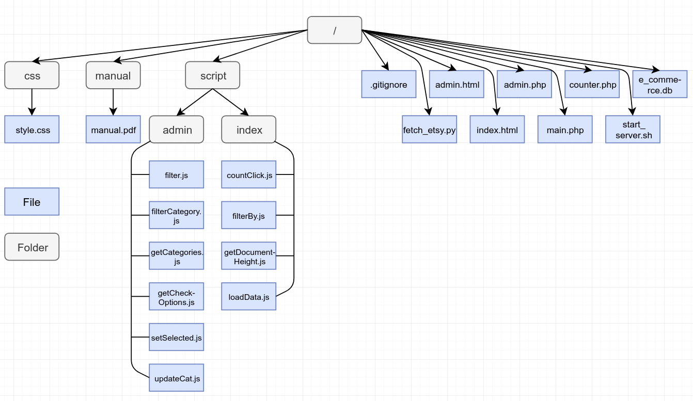

# E-commerce visualizer

The function of this web application is to visualize product data gathered from web stores. The data is collected by Python 3 script.
This script can have its function extended to collect the data from the APIs of several web stores like eBay or Amazon. For this
project, I have only implemented its connection and data gathering logic with Etsy.com's RESTful API. Of course, the
data could also be web scraped and structured like: item title, description, price, image, link to the item on the website of the webstore. 
We are pushing all the data to our local DB on the server. The users could then search and browse through the items, if they see
something of interest, they follow the link to the webstore for the respective item.

There's also an admin page where the categories of the items can be updated and where we could visualize statistical data on the
number of visits and unique visits for each item, price range, and category.

# Technology stack
- **Frontend**:
   

- **Backend**:
    

# Application features

The web application has two pages, index.html, and admin.html.

- Index
To be used by the users of the website. The users could list all items or search for specific items. The items could be searched by
name or description and could be sorted by category and/or price range. Each item has its title, picture, price and currency, description
and link to the vendor's website. When the bottom of the page is reached, if there are more search results in the DB, they will be injected
into the FE.

- Admin
To be used by an admin. The administrator could update the category of an item and/or could visualize statistical data on the
number of visits and unique visits for each item, price range, and category.

# Prerequisites to run this application

You'll need Python 3  and PHP 7.0+ with the respective packages installed to handle SQLite3 communication and SQLite3 to access the DB.
Written and tested under Ubuntu 16.04 LTS.

# Private keys

This application is using certain APIs. You will need to provide your own private keys for each one of them:

| File | Keys |
|------|------|
|fetch_etsy.py|APP_KEY (Etsy API key)|

# Screen shots
|Name|URL|
|----|---|
|Screen 1|https://drive.google.com/open?id=1WO8HY7maOi7ws6VBB2kep2RnIN9Vlyoj|
|Screen 2|https://drive.google.com/open?id=1M8SEdUVYL2MkMYT3pWDkJDIrUD_Qm3Lh|
|Screen 3|https://drive.google.com/open?id=1S3e3Xeljrsh_4kiRFYWF4mx5wzOY5gRK|
|Screen 4|https://drive.google.com/open?id=1ZmRkA820F5lDYKmq-pISCI8NohvnVre0|
|Screen 5|https://drive.google.com/open?id=1e7aeW8DFgGDARf4rGmzm9SaXzmZbTFOs|
|Screen 6|https://drive.google.com/open?id=1BD9Awypim3tI-5SB8HMqvcU8x-wNugHK|

# Presentation video
|Video|URL|
|----|----|
|Video 1|https://youtu.be/Vg7czFcx_Ik|

# Folder structure

# License
BSD License
>Copyright (c) 2019, Tihomir Mladenov, tihomir.mladenov777@gmail.com
All rights reserved.

>Redistribution and use in source and binary forms, with or without
modification, are permitted provided that the following conditions are met:

>1. Redistributions of source code must retain the above copyright notice, this
   list of conditions and the following disclaimer.
>2. Redistributions in binary form must reproduce the above copyright notice,
   this list of conditions and the following disclaimer in the documentation
   and/or other materials provided with the distribution.

>THIS SOFTWARE IS PROVIDED BY THE COPYRIGHT HOLDERS AND CONTRIBUTORS "AS IS" AND
ANY EXPRESS OR IMPLIED WARRANTIES, INCLUDING, BUT NOT LIMITED TO, THE IMPLIED
WARRANTIES OF MERCHANTABILITY AND FITNESS FOR A PARTICULAR PURPOSE ARE
DISCLAIMED. IN NO EVENT SHALL THE COPYRIGHT OWNER OR CONTRIBUTORS BE LIABLE FOR
ANY DIRECT, INDIRECT, INCIDENTAL, SPECIAL, EXEMPLARY, OR CONSEQUENTIAL DAMAGES
(INCLUDING, BUT NOT LIMITED TO, PROCUREMENT OF SUBSTITUTE GOODS OR SERVICES;
LOSS OF USE, DATA, OR PROFITS; OR BUSINESS INTERRUPTION) HOWEVER CAUSED AND
ON ANY THEORY OF LIABILITY, WHETHER IN CONTRACT, STRICT LIABILITY, OR TORT
(INCLUDING NEGLIGENCE OR OTHERWISE) ARISING IN ANY WAY OUT OF THE USE OF THIS
SOFTWARE, EVEN IF ADVISED OF THE POSSIBILITY OF SUCH DAMAGE.

>The views and conclusions contained in the software and documentation are those
of the authors and should not be interpreted as representing official policies,
either expressed or implied, of the E Commerse Visualizer project.
